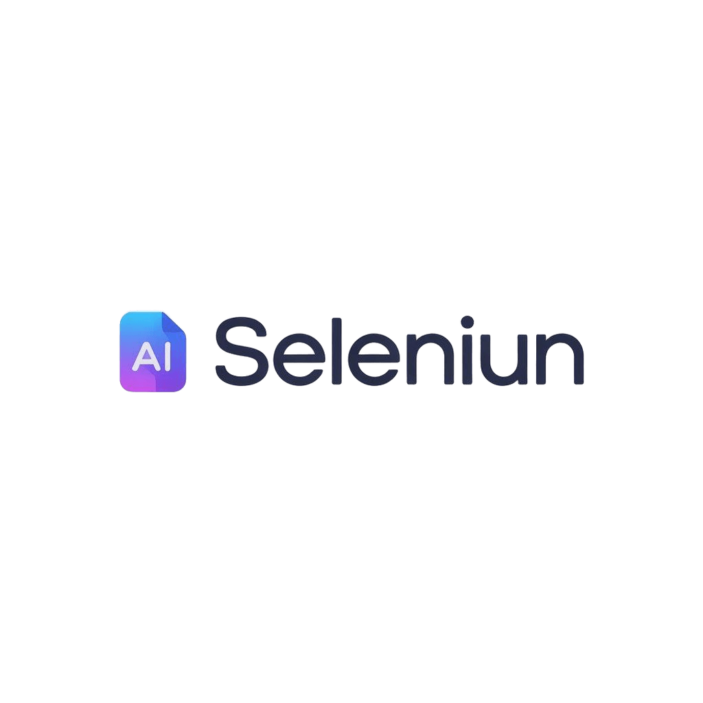

<div align="center">



# Seleniun

**Free, open-source PDF & document toolkit — convert, compress, split, merge, encrypt, sign, and summarize documents, plus an AI writer, self-hosted or as a web app.**

[](LICENSE)


[](#contributing)

[Website](https://www.seleniun.com) · [Report a bug](../../issues) · [Request a feature](../../issues)

</div>

---

## Table of contents

- [About](#about)
- [Features](#features)
- [Tech stack](#tech-stack)
- [Project structure](#project-structure)
- [Getting started](#getting-started)
  - [Prerequisites](#prerequisites)
  - [Clone the repo](#clone-the-repo)
  - [Run the backend](#run-the-backend)
  - [Run the frontend](#run-the-frontend)
- [Environment variables](#environment-variables)
- [API overview](#api-overview)
- [Deployment](#deployment)
- [Contributing](#contributing)
- [License](#license)

## About

Seleniun is a **self-hostable, open-source alternative to iLovePDF / Smallpdf** — a document
processing platform with free online PDF tools plus AI-powered features, built as a
production web app (React frontend + NestJS API) rather than a script or CLI.

It exists as two independent projects in this monorepo:

- **`frontend/`** — the web app (React, TypeScript, Vite, TailwindCSS) that ships the UI at
  [seleniun.com](https://www.seleniun.com).
- **`backend/`** — the NestJS API that does the real work: PDF/Office conversion, compression,
  encryption, and AI text generation/summarization through a pluggable LLM provider.

No sign-up, no vendor lock-in, no telemetry you didn't ask for. Run it yourself, point it at
whatever LLM provider you already have a key for, and it's yours.

## Features

**PDF & document tools**
- 🔄 Convert: PDF ↔ Word, Excel ↔ PDF
- 📦 Compress PDF (Ghostscript-backed, real size reduction)
- ✂️ Split PDF by page ranges, and merge multiple PDFs into one
- 🔒 Encrypt PDF with a real owner/user password (via `pdftk`)
- ✍️ Sign PDF (draw or upload a signature image, position it, download)

**AI-powered**
- 🧠 Summarize PDF — extracts text and generates an executive summary, with an offline
  fallback summarizer if no LLM key is configured
- ✨ AI Document Writer — a rich-text editor with an AI drafting assistant

**Provider-agnostic AI** — the backend isn't locked to one AI vendor. Configure `LLM_PROVIDER`
to `deepseek`, `gemini`, or `cohere` and bring your own API key.

## Tech stack

| Layer | Stack |
|---|---|
| Frontend | React 18, TypeScript, Vite, TailwindCSS, shadcn/ui, react-router-dom |
| Backend | NestJS 10, TypeScript, Express |
| Document processing | Ghostscript, `pdftk`, LibreOffice, `poppler-utils`, PyMuPDF/`pdf2docx` |
| AI | DeepSeek / Gemini / Cohere (pluggable, no vendor lock-in) |
| Deployment | Docker (backend), Vercel (frontend) |

## Project structure

```
seleniun/
├── frontend/      React + Vite web app — see frontend/README.md
├── backend/       NestJS API — see backend/README.md
└── LICENSE
```

## Getting started

### Prerequisites

- [Node.js](https://nodejs.org) 20+
- For full backend functionality (Word/PDF conversion): either [Docker](https://docker.com)
  (recommended — installs everything for you), or locally installed Ghostscript, `pdftk`,
  LibreOffice, `poppler-utils`, and Python 3 with `PyMuPDF`/`pdf2docx`

### Clone the repo

```bash
git clone https://github.com/itsjovdev/seleniun.git
cd seleniun
```

### Run the backend

```bash
cd backend
npm install
cp .env.example .env   # add an LLM provider key if you want AI features
npm run start:dev
```

Or with Docker (recommended, includes every document-processing dependency):

```bash
cd backend
docker compose up --build
```

See [`backend/README.md`](backend/README.md) for the full API reference.

### Run the frontend

```bash
cd frontend
npm install
npm run dev
```

The dev server proxies `/api` requests to `https://api.seleniun.com` by default. To point it
at your local backend instead, set `VITE_API_PROXY_TARGET=http://localhost:3000` before
running `npm run dev`. See [`frontend/README.md`](frontend/README.md) for details.

## Environment variables

Only the **backend** needs configuration, and only for AI features — the conversion,
compression, split/merge, encrypt, and sign tools work with zero configuration.

| Variable | Required for | Default |
|---|---|---|
| `LLM_PROVIDER` | AI summarize / AI writer | `deepseek` |
| `DEEPSEEK_API_KEY` / `GEMINI_API_KEY` / `COHERE_API_KEY` | whichever provider you pick | — |
| `PORT` | — | `3000` |
| `MAX_PAGES`, `MAX_PDF_MB` | AI summarize limits | `15`, `10` |

Full list in [`backend/.env.example`](backend/.env.example).

## API overview

All backend routes are under `/api`. Full docs in [`backend/README.md`](backend/README.md).

| Method | Endpoint | Description |
|---|---|---|
| POST | `/api/convert/pdf-to-word` | PDF → DOCX |
| POST | `/api/convert/word-to-pdf` | DOCX → PDF |
| POST | `/api/convert/compress-pdf` | Compress a PDF |
| POST | `/api/convert/split-pdf` | Split a PDF by page ranges |
| POST | `/api/convert/merge-pdf` | Merge multiple PDFs |
| POST | `/api/pdf-encrypt/encrypt` | Password-protect a PDF |
| POST | `/api/pdf/summarize` | AI summary of a PDF |
| POST | `/api/ai/generate` | General-purpose AI text generation |

## Deployment

- **Backend**: ships a `Dockerfile` + `docker-compose.yml` with every system dependency
  (Ghostscript, `pdftk`, LibreOffice, Python) baked in — deploy it to any container host.
- **Frontend**: static Vite build with a `vercel.json` for Vercel, but it's a plain SPA build
  (`npm run build`) that runs on any static host.

## Contributing

Contributions are welcome — bug fixes, new tools, translations, docs.

1. Fork the repo and create a branch from `main`.
2. Make your change in `frontend/` or `backend/` (see that folder's README for its own
   lint/test/build commands — run them before opening a PR).
3. Open a pull request describing what changed and why.

For bugs, open an [issue](../../issues) with steps to reproduce. For feature ideas, open an
issue describing the use case first so we can discuss the approach.

## License

Released under the [MIT License](LICENSE) — use it, modify it, ship it commercially, no
strings attached.
